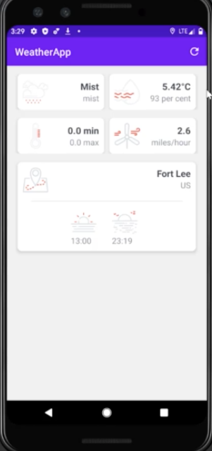

# Weather-app
Displays the weather of current user's location in a beautiful manner

Things I learnt- 

- using the OpenWeather API to get data from websites
- reading and using JSON objects
- using GSON
